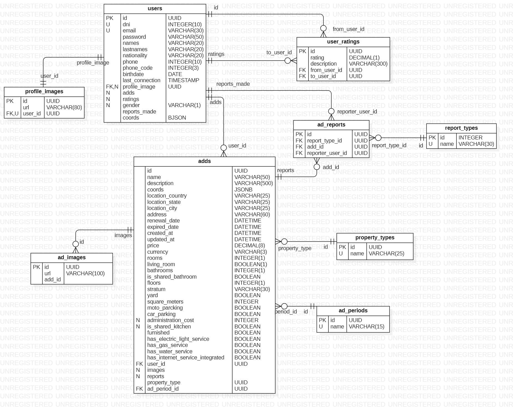

<p align="center">
  <a href="http://nestjs.com/" target="blank"></a>
</p>


## Descripción
Este respositorio corresponde al de Backend ResfullAPI para la aplicación "Comodos" realizada con el stack `Nest.js`, `TypeORM`,`PostgreSQL`, `JsonWebTokens`, `AWS S3`, `AWS CloudFront`.   
El desarrollo frontend está ubicado en el repositorio [Comodos Frontend](https://github.com/sebasmrl/comodos-frontend)

## Instalación

```bash
$ npm install
```

## Ejecutar app

```bash
# development
$ npm run start

# watch mode
$ npm run start:dev

# production mode
$ npm run start:prod
```

## Dependencias
Estas dependencias no son necesarias instalarlas puesto que al ejecutar `npm install` quedaron instaladas.
```bash
npm i @nestjs/config
npm i class-validator class-transformer
npm install --save @nestjs/typeorm typeorm pg
npm i bcrypt
npm i @nestjs/passport passport @nestjs/jwt passport-jwt 
npm i --save-dev @types/passport-jwt
npm install uuid

npm i -D @types/multer

npm i @aws-sdk/client-s3
npm i @aws-sdk/s3-request-presigner     #para generar url de acceso temporal para el cliente


# usar este comando para generar claves de forma automatica
openssl rand -base64 64
```

## Modelo Entidad Relación



## Notas

1. El modulo common provee servicios para seleccion de ubicación, por ahora solo en Colombia  
(Los Datos fueron tomados del DANE en un archivo CSV) [CSV](./src/common/data/Departamentos_y_municipios_de_Colombia_20250123.csv)  recurso tomado de [Datos Abiertos de Colombia](https://www.datos.gov.co/Mapas-Nacionales/Departamentos-y-municipios-de-Colombia/xdk5-pm3f/about_data).
Lo datos tomados del  [CSV](./src/common/data/Departamentos_y_municipios_de_Colombia_20250123.csv) fueron transformados a un JSON legible a traves de un endpoint en commons llamado `/csv`, dicho endpoint no se estipula tener publico dado que es para un uso especifico.


## Soporte
- Sebastian Morales - `davesebastian99@gmail.com`


## Mantente en contacto
- Author - [Sebastian Morales](https://sebastianmorales.dev)
- Linkedin - [Perfil de linkedin](https://www.linkedin.com/in/deivy-sebastian-morales/)
- Framework - [https://nestjs.com](https://nestjs.com/)


